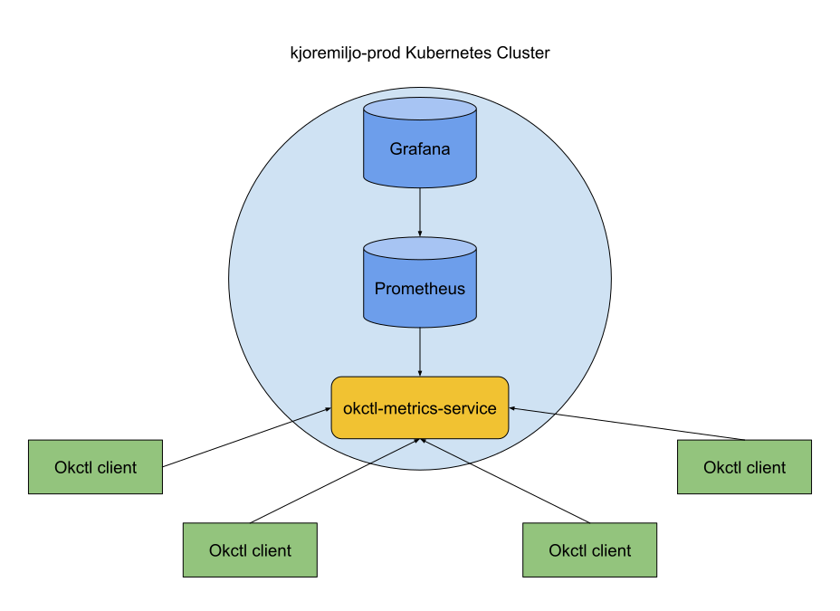

# okctl-metrics-service
A service collecting metrics for okctl

See [specification.yaml](specification.yaml) for the API specification.

## Integrations

### Okctl

`okctl` sends events to `okctl-metrics-service` by using an HTTPs client. Requests get sent as a POST request on 
`/v1/metrics/events` and should look something like this:

```json
{
  "category": "my-category",
  "action": "my-action"
}
```

To be able to send requests, you need to use `okctl` as the user agent. This to avoid the majority of false positive
requests from internet bots and what not.

A working `curl` example would be:
```shell
curl <service URL>/v1/metrics/events \
  -X POST \
  -H "User-Agent: okctl" \
  -H "Content-Type: application/json" \
  -d '{"category": "cluster", "action": "scaffold"}'
```

### Prometheus

`okctl-metrics-service` exposes an endpoint on `/z/prometheus` that is harvested by a Prometheus agent. Each metric is
prefixed with `okctl_`.

## Architecture

